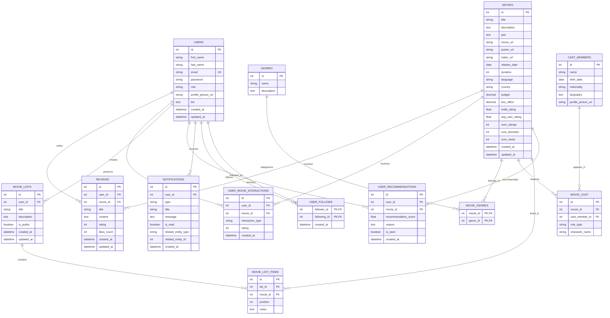

# IEEEMDB Entity-Relationship Diagram

## Visual ER Diagram



## Entity Descriptions

### Core Entities

#### Users
- **Purpose**: Store user account information and profiles
- **Key Features**: Authentication, profiles, role-based access
- **Relationships**: Central entity connecting to all user activities

#### Movies
- **Purpose**: Complete movie catalog with metadata
- **Key Features**: Rich metadata, ratings, statistics
- **Relationships**: Core content entity linked to all interactions

#### Genres
- **Purpose**: Movie categorization system
- **Key Features**: Hierarchical categorization, search optimization
- **Relationships**: Many-to-many with movies

#### Cast_Members
- **Purpose**: Actor, director, and crew information
- **Key Features**: Biography, filmography tracking
- **Relationships**: Many-to-many with movies through roles

### Interaction Entities

#### Reviews
- **Purpose**: Detailed user feedback on movies
- **Key Features**: Ratings, text reviews, social engagement
- **Relationships**: Links users to movies with detailed feedback

#### User_Movie_Interactions
- **Purpose**: Track all user engagement with movies
- **Key Features**: Views, favorites, watchlist, quick ratings
- **Relationships**: Flexible interaction tracking system

#### Movie_Lists
- **Purpose**: User-curated movie collections
- **Key Features**: Custom lists, public/private sharing
- **Relationships**: Users create lists containing multiple movies

### System Entities

#### User_Recommendations
- **Purpose**: Personalized movie suggestions
- **Key Features**: Algorithm-driven recommendations, tracking
- **Relationships**: System-generated user-movie connections

#### Notifications
- **Purpose**: User engagement and updates
- **Key Features**: Multiple notification types, read status
- **Relationships**: User-centric communication system

#### User_Follows
- **Purpose**: Social networking features
- **Key Features**: Follow relationships, social discovery
- **Relationships**: Self-referencing user connections

## Key Relationship Patterns

### 1. User-Centric Design
- All major entities connect back to users
- Supports personalization and user experience tracking
- Enables comprehensive user profiles

### 2. Content Organization
- Movies as central content entity
- Multiple categorization methods (genres, cast, lists)
- Rich metadata for search and discovery

### 3. Interaction Tracking
- Multiple interaction types supported
- Historical tracking for recommendations
- Social features for community building

### 4. Scalability Considerations
- Junction tables for many-to-many relationships
- Denormalized statistics for performance
- Modular design for feature expansion

## Database Implementation Notes

### Indexes
```sql
-- Performance-critical indexes
CREATE INDEX idx_users_email ON users(email);
CREATE INDEX idx_movies_title ON movies(title);
CREATE INDEX idx_movies_rating ON movies(avg_user_rating DESC);
CREATE INDEX idx_reviews_user_movie ON reviews(user_id, movie_id);
CREATE INDEX idx_interactions_user ON user_movie_interactions(user_id);
CREATE INDEX idx_notifications_user_unread ON notifications(user_id, is_read);
```

### Constraints
```sql
-- Business logic constraints
ALTER TABLE reviews ADD CONSTRAINT chk_rating CHECK (rating BETWEEN 1 AND 10);
ALTER TABLE user_movie_interactions ADD CONSTRAINT chk_interaction_rating CHECK (rating IS NULL OR rating BETWEEN 1 AND 10);
ALTER TABLE movies ADD CONSTRAINT chk_duration CHECK (duration > 0);
ALTER TABLE user_follows ADD CONSTRAINT chk_no_self_follow CHECK (follower_id != following_id);
```